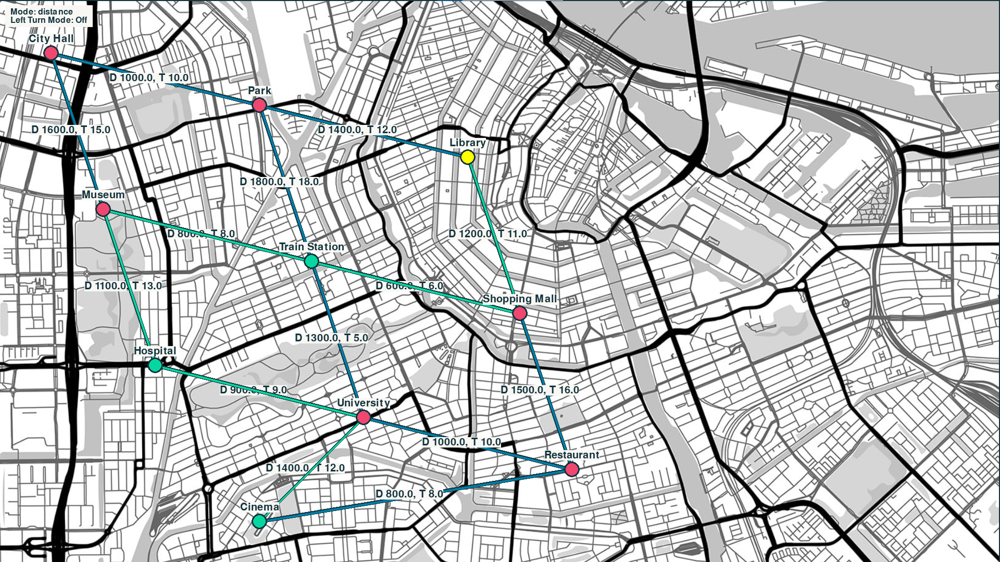

# MAPS SIMULATOR PROJECT

## Database setup

1. Install the mysql database according to your system (for windows follow [this](https://www.w3schools.com/mysql/mysql_install_windows.asp) link.)
2. Set everything up (including adding `'C:\Program Files\MySQL\MySQL Server 8.0\bin'` to the path enviromental variables)
3. Connect to the `mysql` bash using `mysql -u root -p <set-password>` command and create a `spdb` database using `CREATE DATABASE spdb;` command.
4. Set up your `.env` file with the variables:
   - `DB_HOST="localhost"`
   - `DB_USER="root"`
   - `DB_PASSWORD="<your-password>"`
   - `DB_NAME="spdb"`
5. To test if everything is set up correctly - please execute `python3 ./test/scripts/db_connectivity_test.py`

## Running app

1. Before running the application please first execute the `init_tables.py` and `fill_tables.py`. Make sure that the database is initialized correctly.
2. Run the main app using `python3 run.py` command.

## Client requirements

### ENGLISH

Finding the best route. Implementation of an application for determining the best route according to the given ones
parameters, developing a method and performing tests to check its practical usability
proposed solutions (calculating a route in cities for several or more given places to
visit). The basic parameters for choosing the best route are: time and distance.
An additional requirement is to minimize left turns.
Final documentation should include:

- Description of the method for determining the best route, including how to select the best route. Model description
  data.
- Description of the application architecture.
- Information about the implementation (algorithms used + commented source code).
- Description and results of the tests performed.

### POLISH (original)

Znajdowanie najlepszej trasy. Implementacja aplikacji do wyznaczania najlepszej trasy wg zadanych
parametrów, opracowanie metody oraz wykonanie testów sprawdzających praktyczną użyteczność
zaproponowanych rozwiązań (wyznaczanie trasy w miastach dla kilku lub więcej podanych miejsc do
odwiedzenia). Podstawowymi parametrami do wyboru najlepszej trasy jest: czas i odległość.
Dodatkowym wymogiem jest minimalizacja skrętów w lewo.
Dokumentacja końcowa powinna zawierać:

- Opis metody wyznaczania najlepszej drogi, w tym sposobu wyboru najlepszej trasy. Opis modelu
  danych.
- Opis architektury aplikacji.
- Informacje o implementacji (wykorzystane algorytmy + skomentowany kod źródłowy).
- Opis i wyniki przeprowadzonych testów.
